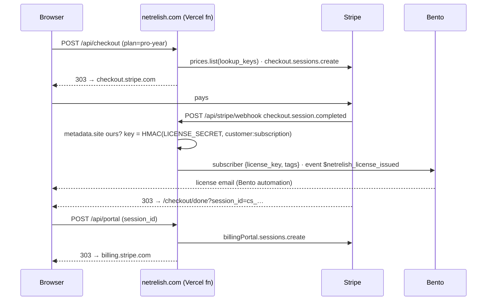

# Stripe on netrelish-site

The store: hosted Checkout for the yearly and lifetime Pro licenses, the Customer Portal for self-serve billing, and a
webhook that turns payments into license keys. No Stripe.js anywhere on our pages — the network rule forbids third-party
hosts, so every Stripe surface is a `303` from one of our routes to a page Stripe hosts.

This plan came out of Stripe's implementation planner for NetRelish Pro and was accepted with shape `hosted Checkout / web`.
The doc links under each decision are the ones it recommended.

## Decisions

| Question | Decision | Why |
| --- | --- | --- |
| Checkout surface | **Stripe-hosted Checkout**, `303` redirect from `/api/checkout` | Site allows no foreign scripts; Checkout is also the highest-converting option Stripe offers. [docs](https://docs.stripe.com/payments/accept-a-payment?payment-ui=checkout&ui=stripe-hosted) |
| Pricing model | **Flat rate** | One product, two prices. [docs](https://docs.stripe.com/products-prices/pricing-models#flat-rate) |
| Billing model | **Pay up front, no trial** | Free is the app itself; nothing to trial. [docs](https://docs.stripe.com/billing/subscriptions/build-subscriptions) |
| Yearly | **`subscription` mode**, `netrelish_pro_year` | Renews at the same price. |
| Lifetime | **`payment` mode**, `netrelish_pro_lifetime`, `customer_creation: always` | A lifetime plan is not a subscription; the Customer is still created so the buyer gets the Portal and a receipt history. |
| Self-service | **Customer Portal** from `/api/portal` | Cancel, update card, invoice history, tax ID — zero custom UI. [docs](https://docs.stripe.com/customer-management/integrate-customer-portal) |
| Failed renewals | **Smart Retries** + Portal link in the failure email | Stripe's ML retry schedule beats any fixed one. [docs](https://docs.stripe.com/billing/revenue-recovery/smart-retries) |
| Tax | **Stripe Tax** (`automatic_tax` + `tax_id_collection`) | Already active on the account (head office Tucson, AZ). [docs](https://docs.stripe.com/tax) |
| Team / invoice sales | **Dashboard invoice** tagged `site` + `plan`, hosted invoice page, card or ACH | Rare; the API buys nothing here. [docs](https://docs.stripe.com/invoicing/ach-direct-debit) |
| Reconciliation | **`invoice.paid` webhook** into our fulfilment | Our license system is in-house; `invoice.paid` is the canonical settled event. [docs](https://docs.stripe.com/invoicing/integration) |

## The brand tag

NetRelish has its own Stripe account (`NetRelish`, `acct_1UKED1EhohwIPQev`, plus a sandbox `acct_1UKED7EXV0twADEp`).
It was briefly on the shared Shepdesign account, and the brand tag that protected it there stays on as belt-and-braces,
because Stripe sends every account event to every endpoint that subscribes to it:

- Everything this site creates carries **`metadata.site = "netrelish.com"`** (`SITE` in `src/lib/hosts.ts`), on the Checkout
  Session and copied onto the subscription and its invoices.
- The webhook **acts only on events carrying that tag** and acknowledges everything else with `handled: false`. Another
  brand's sale on the same account never issues a NetRelish key or emails a NetRelish subscriber.
- A Dashboard invoice that should issue a NetRelish key needs **both** `metadata.site=netrelish.com` and `metadata.plan`.
- Other brands run their own endpoint, their own tag, their own catalog, in their own repo. Products are matched by
  `metadata.slug` and prices by `lookup_key`, so catalogs never collide.

## How it fits together

| Piece | File | Notes |
| --- | --- | --- |
| Catalog | `src/lib/stripe/catalog.ts` | `plan` → mode + price **lookup keys**. No price ids in code. A plan may add a one-time `oneTime` line to a subscription for a dearer first year. |
| Checkout | `src/lib/checkout.ts` → `/api/checkout` | Same-origin check, plan lookup, session create, `303`. JSON in → JSON out. |
| Portal | `src/lib/portal.ts` → `/api/portal` | Takes the Checkout Session id from the done page; `cs_…` ids are unguessable. |
| Webhook | `src/lib/webhook.ts` → `/api/stripe/webhook` | Raw-body signature check, site tag check. 2xx only after fulfilment ran; anything else makes Stripe retry. |
| License keys | `src/lib/license.ts` | `NR-XXXXX-XXXXX-XXXXX-XXXXX-XXXXX`, derived from `customer:subject`. Redelivery → same key. |
| Fulfilment | `src/lib/fulfil.ts` | Bento today (fields + event). Swap in a DB/mailer without touching the webhook. |
| Success page | `src/pages/checkout/done.astro` | Server-rendered so the session id reaches the portal form with no client JS. |
| Buy buttons | `src/components/Pro.astro` | Rendered only when `PUBLIC_STORE_OPEN=true` at build time. |
| Seed | `scripts/stripe-seed.mjs` + `stripe/catalog.netrelish.json` | Idempotent: products by `metadata.slug`, prices by `lookup_key`. |

### Webhook events and what they mean here

Every row first requires `metadata.site = netrelish.com`; otherwise the event is acknowledged and ignored.

| Event | Action |
| --- | --- |
| `checkout.session.completed` (`payment_status=paid`) | Issue license, key on `customer:subscription` or `customer:payment_intent` |
| `checkout.session.completed` (unpaid) | Nothing — a delayed method (ACH) is still settling |
| `checkout.session.async_payment_succeeded` | Issue license |
| `checkout.session.async_payment_failed` | `payment.failed` event |
| `invoice.paid`, `billing_reason=subscription_cycle` | `license.renewed` |
| `invoice.paid`, `billing_reason=manual` **and** `metadata.plan` set | Issue license (Dashboard invoice), key on `customer:invoice` |
| `invoice.paid`, `subscription_create` | Nothing — Checkout already issued it |
| `invoice.payment_failed` | `payment.failed` with the hosted invoice link |
| `customer.subscription.deleted` | `license.ended` |

## Setup

Already done on the NetRelish account (2026-09-27), in live mode, test mode and the sandbox alike:

- **Catalog seeded**: `NetRelish Pro` (live `prod_VKvzjV4EMMjL9N`, test `prod_VKvF0nrWT6uvx4`, sandbox
  `prod_VKvGEDG1ho0LOJ`), tax code `txcd_10202000` (downloadable software, personal use — confirm with your accountant),
  with `netrelish_pro_year` $39/yr and `netrelish_pro_lifetime` $99.
- **Webhook endpoints** → `https://netrelish.com/api/stripe/webhook`, API version `2026-08-26.dahlia` (matches the SDK),
  exactly the events in the table above: live `we_1UKG78EhohwIPQevDQ6fpVG2` (its signing secret is the Production
  `STRIPE_WEBHOOK_SECRET`) and test `we_1UKFQGEhohwIPQevLe4uIA5u` (Preview).
- On the Shepdesign account the earlier NetRelish prices are archived and its endpoint is disabled (delete it when
  convenient); the archived product `prod_VKsugJCePHxbWj` can be archived from the Dashboard.

Still to do:

1. **Vercel env** on `netrelish` (all Sensitive): `STRIPE_WEBHOOK_SECRET` (live endpoint's secret on Production, test
   endpoint's on Preview; shown once at creation, roll it from the endpoint page if lost), `LICENSE_SECRET`
   (`openssl rand -base64 48`, same value on both), and `STRIPE_SECRET_KEY`: Developers → API keys → restricted key with
   *Checkout Sessions, Customers, Prices, Products, Billing Portal: write* — a live key on Production, a test key on
   Preview. Preview then rehearses against test mode end to end with the same code.
2. **Stripe Tax** on the NetRelish account: Settings → Tax → enable, confirm the head office, add the Arizona
   registration. `automatic_tax` on Checkout errors until this is done.
3. **Customer Portal** (Settings → Billing → Customer portal): cancel on, payment method update on, invoice history on,
   tax ID on, plan switching off (a lifetime buyer has nothing to switch to). Default return URL `https://netrelish.com/#pro`.
   Enable the no-code **portal login page** and put its link in the license email — that is the "lost my link" path.
4. **Bento.** An automation on `$netrelish_license_issued` that emails `{{ subscriber.license_key }}`, one on
   `$netrelish_payment_failed` that links `details.payUrl`, and one on `$netrelish_license_ended`. `$netrelish_license_renewed`
   can just be a receipt.
5. **Dashboard**: Smart Retries on (Billing → Subscriptions and emails), failed-payment emails on, *Include a link to a
   payment page in the invoice email* on. Branding: logo + relish for Checkout, Portal, invoices, receipts.
6. Merge, then set `PUBLIC_STORE_OPEN=true` on Production and redeploy. The buy buttons appear; nothing else changes.

### Selling by invoice

Invoices → New. Set **metadata `site=netrelish.com`** and **`plan=pro-lifetime`** (or `pro-year` for a manually renewed
seat). Payment methods: card + **ACH Direct Debit** — Financial Connections instant verification is the default,
microdeposits the fallback. When it's paid, the webhook issues the key exactly as for a Checkout purchase.

### Identity and Financial Connections — assessment

- **Financial Connections**: yes, and you get it for free. It is the default bank-verification step inside hosted
  Checkout, the hosted invoice page and the Portal for ACH. No code. Only reach for the Financial Connections API
  (balances, ownership) if you start pre-authorizing large ACH debits and want an NSF check — not now.
- **Identity**: not recommended for launch. Card-not-present software sales at $39–$99 are protected by **Radar**, 3DS
  where the issuer asks, and Stripe Tax's address collection. Identity adds ~$1.50 per verification and a document flow
  that will cost more in abandoned checkouts than it saves in fraud. Revisit if you see targeted card testing on the
  lifetime plan (then: a Radar rule on card velocity first, Identity second).

## Testing

Sandbox keys, `npm run dev`, `stripe listen --forward-to localhost:4321/api/stripe/webhook`, then buy with
`4242 4242 4242 4242`. ACH: pick *Test Institution* in Checkout. Delayed settlement: `4000 0000 0000 3220` (3DS) or an ACH
purchase, and watch `async_payment_succeeded` land. Unit tests (`npm test`) cover every route with a fake Stripe client and
the real signature code, including the other-brand events the webhook must ignore.

## The Shepdesign account

Care plans and the Supabase webhook live on the Shepdesign account and are untouched. With NetRelish on its own account
nothing from this store reaches that endpoint any more.

## Later, if you want legendary

- **License verification route** (`/api/license/verify`): same HMAC, so the app can check a key with one call.
- **Adaptive Pricing** in Checkout for non-USD buyers — one Dashboard toggle.
- **Checkout `consent_collection.terms_of_service`** once the public terms URL is set in Business settings.
- **Upsell**: `pro-year` → `pro-lifetime` as a Checkout upsell, no code beyond the Dashboard.
