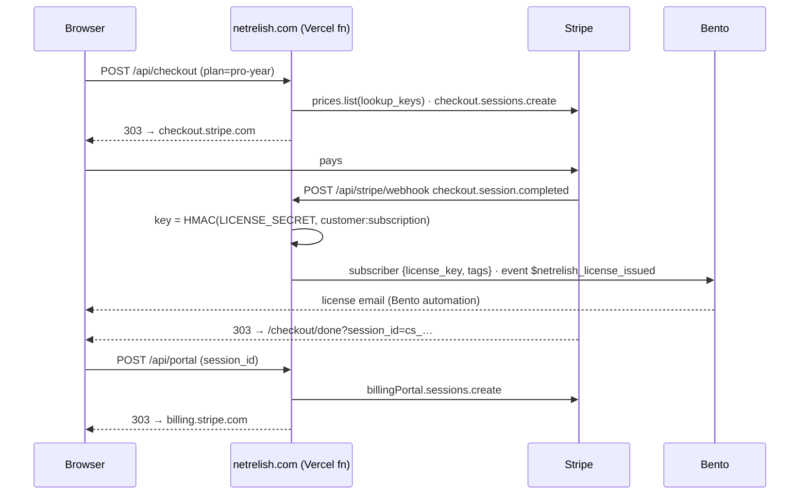

# Stripe on netrelish-site

The store: hosted Checkout for one-time and yearly licenses, the Customer Portal for self-serve billing, a webhook that turns
payments into license keys, and Dashboard invoices (card or ACH) for agency deals. No Stripe.js anywhere on our pages — the
network rule forbids third-party hosts, so every Stripe surface is a `303` from one of our routes to a page Stripe hosts.

This plan came out of Stripe's implementation planner for Shepdesign's catalog (Hooked on Facets tiers and NetRelish Pro) and
was accepted with shape `hosted Checkout / web`. The doc links under each decision are the ones it recommended.

## Decisions

| Question | Decision | Why |
| --- | --- | --- |
| Checkout surface | **Stripe-hosted Checkout**, `303` redirect from `/api/checkout` | Site allows no foreign scripts; Checkout is also the highest-converting option Stripe offers. [docs](https://docs.stripe.com/payments/accept-a-payment?payment-ui=checkout&ui=stripe-hosted) |
| Pricing model | **Flat rate per tier** | Tiers are products (1 / 5 / 25 sites), not seats. [docs](https://docs.stripe.com/products-prices/pricing-models#flat-rate) |
| Billing model | **Pay up front, no trial** | The free tier lives on wordpress.org / in the app with no card. [docs](https://docs.stripe.com/billing/subscriptions/build-subscriptions) |
| Renewals at half price | **Recurring price at 50% + one-time "first year" line** on the same Checkout Session | Declarative: no coupon to apply later, no webhook race, renewals can't accidentally bill full price. [docs](https://docs.stripe.com/payments/checkout/migrating-prices#server-side-code-for-recurring-price-with-setup-fee) |
| Lifetime license | **`payment` mode** Checkout, `customer_creation: always` | A lifetime plan is not a subscription; the Customer is still created so the buyer gets the Portal and a receipt history. |
| Self-service | **Customer Portal** from `/api/portal` | Cancel, update card, invoice history, tax ID — zero custom UI. [docs](https://docs.stripe.com/customer-management/integrate-customer-portal) |
| Failed renewals | **Smart Retries** + Portal link in the failure email | Stripe's ML retry schedule beats any fixed one. [docs](https://docs.stripe.com/billing/revenue-recovery/smart-retries) |
| Tax | **Stripe Tax** (`automatic_tax` + `tax_id_collection`) | Already active on the account (head office Tucson, AZ). [docs](https://docs.stripe.com/tax) |
| Agency invoices | **Dashboard + invoice template**, hosted invoice page, card or **ACH via Financial Connections** | A human sends a handful a month; the API buys nothing here. [docs](https://docs.stripe.com/invoicing/ach-direct-debit) |
| Reconciliation | **`invoice.paid` webhook** into our fulfilment | Our license system is in-house; `invoice.paid` is the canonical settled event. [docs](https://docs.stripe.com/invoicing/integration) |

## How it fits together



| Piece | File | Notes |
| --- | --- | --- |
| Catalog | `src/lib/stripe/catalog.ts` | `plan` → mode + price **lookup keys**. No price ids in code. |
| Checkout | `src/lib/checkout.ts` → `/api/checkout` | Same-origin check, plan lookup, session create, `303`. JSON in → JSON out. |
| Portal | `src/lib/portal.ts` → `/api/portal` | Takes the Checkout Session id from the done page; `cs_…` ids are unguessable. |
| Webhook | `src/lib/webhook.ts` → `/api/stripe/webhook` | Raw-body signature check. 2xx only after fulfilment ran; anything else makes Stripe retry. |
| License keys | `src/lib/license.ts` | `NR-XXXXX-XXXXX-XXXXX-XXXXX-XXXXX`, derived from `customer:subject`. Redelivery → same key. |
| Fulfilment | `src/lib/fulfil.ts` | Bento today (fields + event). Swap in a DB/mailer without touching the webhook. |
| Success page | `src/pages/checkout/done.astro` | Server-rendered so the session id reaches the portal form with no client JS. |
| Buy buttons | `src/components/Pro.astro` | Rendered only when `PUBLIC_STORE_OPEN=true` at build time. |
| Seed | `scripts/stripe-seed.mjs` + `stripe/catalog.*.json` | Idempotent: products by `metadata.slug`, prices by `lookup_key`. |

### Webhook events and what they mean here

| Event | Action |
| --- | --- |
| `checkout.session.completed` (`payment_status=paid`) | Issue license, key on `customer:subscription` or `customer:payment_intent` |
| `checkout.session.completed` (unpaid) | Nothing — a delayed method (ACH) is still settling |
| `checkout.session.async_payment_succeeded` | Issue license |
| `checkout.session.async_payment_failed` | `payment.failed` event |
| `invoice.paid`, `billing_reason=subscription_cycle` | `license.renewed` |
| `invoice.paid`, `billing_reason=manual` **and** `metadata.plan` set | Issue license (agency invoice), key on `customer:invoice` |
| `invoice.paid`, `subscription_create` | Nothing — Checkout already issued it |
| `invoice.payment_failed` | `payment.failed` with the hosted invoice link |
| `customer.subscription.deleted` | `license.ended` |

## Setup

1. **Pick the account.** Three live accounts are connected (Abduct This, Shepdesign, True Vet Value); the Shepdesign account
   (`acct_1LZ5HPI31LsBskzX`) already has Stripe Tax active and the care-plan catalog. Make a **sandbox** on it first.
2. **Keys.** Developers → API keys → restricted key with *Checkout Sessions, Customers, Prices, Products, Billing Portal: write*,
   *Webhooks: read*. That is `STRIPE_SECRET_KEY`.
3. **Seed the catalog.**
   ```
   STRIPE_SECRET_KEY=sk_test_… node scripts/stripe-seed.mjs stripe/catalog.netrelish.json --dry-run
   STRIPE_SECRET_KEY=sk_test_… node scripts/stripe-seed.mjs stripe/catalog.netrelish.json
   ```
   `stripe/catalog.hookedonfacets.json` seeds the Hooked on Facets tiers the same way; add the plans to `catalog.ts` on that site.
   Tax codes in the JSON are a starting point (downloadable software, personal/business); confirm them with your accountant.
4. **Webhook.** Developers → Webhooks → add `https://netrelish.com/api/stripe/webhook` with exactly the events in the table above.
   The signing secret is `STRIPE_WEBHOOK_SECRET`. Locally: `stripe listen --forward-to localhost:4321/api/stripe/webhook`.
5. **`LICENSE_SECRET`.** `openssl rand -base64 48`. Rotating it changes every key ever issued, so treat it like a signing key.
6. **Customer Portal** (Settings → Billing → Customer portal): cancel on, payment method update on, invoice history on, tax ID on,
   plan switching off (a lifetime buyer has nothing to switch to). Set the default return URL to `https://netrelish.com/#pro`.
   Also enable the no-code **portal login page** and put its link in the license email — that is the "lost my link" path.
7. **Bento.** Create an automation on `$netrelish_license_issued` that emails `{{ subscriber.license_key }}`, one on
   `$netrelish_payment_failed` that links `details.payUrl`, and one on `$netrelish_license_ended`. `$netrelish_license_renewed`
   can just be a receipt.
8. **Vercel env** (Production + Preview, all Sensitive): `STRIPE_SECRET_KEY`, `STRIPE_WEBHOOK_SECRET`, `LICENSE_SECRET`, plus the
   existing `BENTO_*`. Then `PUBLIC_STORE_OPEN=true` (Production only) to swap the beta CTA for buy buttons on the next build.
9. **Dashboard**: turn on Smart Retries (Billing → Subscriptions and emails), failed-payment emails, and *Include a link to a
   payment page in the invoice email*. Branding: logo + relish for Checkout, Portal, invoices, receipts.

### Agency invoices (Hooked on Facets)

Invoices → New. Use the *Agency license* invoice template (memo, footer, net-15). Add **metadata `plan=hof-agency`** — that is
what tells the webhook to issue a key when it's paid. Payment methods: card + **ACH Direct Debit**; Financial Connections instant
verification is the default, microdeposits the fallback. Prefer ACH above ~$1k: card fees are a percentage, ACH is capped.
Renewal at half price: create the next year's invoice from the template with the renewal amount; or, if the agency prefers
auto-renew, create a subscription in the Dashboard on `hof_agency_year` with a one-off `hof_agency_first_year` invoice item.

### Identity and Financial Connections — assessment

- **Financial Connections**: yes, but you get it for free. It is the default bank-verification step inside hosted Checkout,
  the hosted invoice page and the Portal for ACH. No code. Only reach for the Financial Connections API (balances, ownership)
  if you start pre-authorizing large ACH debits and want an NSF check — not now.
- **Identity**: not recommended for launch. Card-not-present software sales at $39–$399 are protected by **Radar**, 3DS where
  the issuer asks, and Stripe Tax's address collection. Identity adds ~$1.50 per verification and a document flow that will cost
  more in abandoned checkouts than it saves in fraud. Revisit if you see targeted card testing on the lifetime plan
  (then: Radar rule `:card_count: > 3 in 1 hour` first, Identity second) or if agency partners ever need KYC for payouts.

## Testing

Sandbox keys, `npm run dev`, `stripe listen` as above, then buy with `4242 4242 4242 4242`. ACH: pick *Test Institution* in
Checkout. Delayed settlement: `4000 0000 0000 3220` (3DS) or an ACH purchase, and watch `async_payment_succeeded` land.
Unit tests (`npm test`) cover every route with a fake Stripe client and the real signature code.

## What the account already had

The Shepdesign account carries the care-plan catalog (Front Porch, Workshop, Studio, Corner Store, Main Street, Trading Post,
Trailhead, Crossroads, Landmark) and one live webhook to a Supabase function for `checkout.session.completed` and
`customer.subscription.*`, plus a disabled WordPress endpoint on an old API version (2022-08-01). None of that conflicts with
this store: the new endpoint is separate, the new products are matched by slug, and prices by lookup key. Two things worth doing
there anyway: delete the disabled WordPress endpoint, and give the Supabase endpoint `invoice.paid` / `invoice.payment_failed`
if it fulfils anything (it currently can't see a failed renewal).

## Later, if you want legendary

- **License verification route** (`/api/license/verify`): same HMAC, so the WordPress plugin can check a key + site count with
  one call. Store site activations in Bento fields or a KV.
- **Adaptive Pricing** in Checkout for non-USD buyers — one Dashboard toggle.
- **Checkout `consent_collection.terms_of_service`** once the public terms URL is set in Business settings.
- **Upsell**: `pro-year` → `pro-lifetime` as a Checkout upsell, no code beyond the Dashboard.
