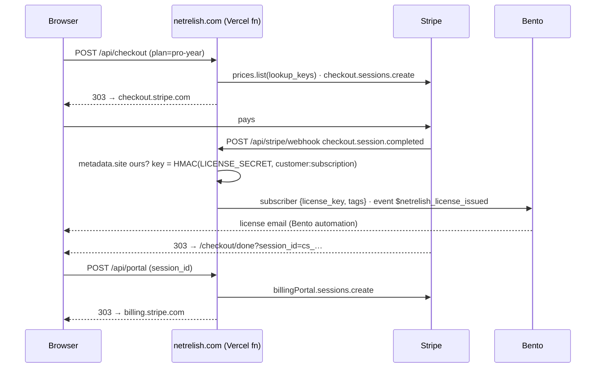

# Stripe on netrelish-site

The store: hosted Checkout for the yearly and lifetime Pro licenses, the Customer Portal for self-serve billing, and a
webhook that turns payments into license keys. No Stripe.js anywhere on our pages — the network rule forbids third-party
hosts, so every Stripe surface is a `303` from one of our routes to a page Stripe hosts.

This plan came out of Stripe's implementation planner for NetRelish Pro and was accepted with shape `hosted Checkout / web`.
The doc links under each decision are the ones it recommended.

## Decisions

| Question | Decision | Why |
| --- | --- | --- |
| Checkout surface | **Stripe-hosted Checkout**, `303` redirect from `/api/checkout` | Site allows no foreign scripts; Checkout is also the highest-converting option Stripe offers. [docs](https://docs.stripe.com/payments/accept-a-payment?payment-ui=checkout&ui=stripe-hosted) |
| Pricing model | **Flat rate** | One product, two prices. [docs](https://docs.stripe.com/products-prices/pricing-models#flat-rate) |
| Billing model | **Pay up front, no trial** | Free is the app itself; nothing to trial. [docs](https://docs.stripe.com/billing/subscriptions/build-subscriptions) |
| Yearly | **`subscription` mode**, `netrelish_pro_year` | Renews at the same price. |
| Lifetime | **`payment` mode**, `netrelish_pro_lifetime`, `customer_creation: always` | A lifetime plan is not a subscription; the Customer is still created so the buyer gets the Portal and a receipt history. |
| Self-service | **Customer Portal** from `/api/portal` | Cancel, update card, invoice history, tax ID — zero custom UI. [docs](https://docs.stripe.com/customer-management/integrate-customer-portal) |
| Failed renewals | **Smart Retries** + Portal link in the failure email | Stripe's ML retry schedule beats any fixed one. [docs](https://docs.stripe.com/billing/revenue-recovery/smart-retries) |
| Tax | **Stripe Tax** (`automatic_tax` + `tax_id_collection`) | Right rate per jurisdiction for downloadable software; must be activated on the account before the first Checkout (Setup, step 0). [docs](https://docs.stripe.com/tax) |
| Team / invoice sales | **Dashboard invoice** tagged `site` + `plan`, hosted invoice page, card or ACH | Rare; the API buys nothing here. [docs](https://docs.stripe.com/invoicing/ach-direct-debit) |
| Reconciliation | **`invoice.paid` webhook** into our fulfilment | Our license system is in-house; `invoice.paid` is the canonical settled event. [docs](https://docs.stripe.com/invoicing/integration) |

## Which Stripe account

The store runs on **NetRelish's own Stripe account**, not the Shepdesign one. Everything below — catalog, webhook endpoint,
portal configuration, keys — is created there, by the scripts in `scripts/`, from the NetRelish key. Nothing in this repo
carries an account or price id; products are matched by `metadata.slug` and prices by `lookup_key`, so the same code runs
against a sandbox and the live account.

Every object this site creates still carries **`metadata.site = "netrelish.com"`** (`SITE` in `src/lib/hosts.ts`), and the
webhook acts only on events carrying it. On a dedicated account that is insurance rather than a necessity: a Dashboard test
charge, a manually created subscription, or a future second product never becomes a Pro license by accident. A Dashboard
invoice that *should* issue a key needs both `metadata.site=netrelish.com` and `metadata.plan`.

## How it fits together

| Piece | File | Notes |
| --- | --- | --- |
| Catalog | `src/lib/stripe/catalog.ts` | `plan` → mode + price **lookup keys**. No price ids in code. A plan may add a one-time `oneTime` line to a subscription for a dearer first year. |
| Checkout | `src/lib/checkout.ts` → `/api/checkout` | Same-origin check, plan lookup, session create, `303`. JSON in → JSON out. |
| Portal | `src/lib/portal.ts` → `/api/portal` | Takes the Checkout Session id from the done page; `cs_…` ids are unguessable, and the id only opens billing for 24 hours (it lives in browser history). After that: the portal login page linked from the license email. |
| Webhook | `src/lib/webhook.ts` → `/api/stripe/webhook` | Raw-body signature check, site tag check. 2xx only after fulfilment ran; anything else makes Stripe retry. |
| License keys | `src/lib/license.ts` | `NR-XXXXX-XXXXX-XXXXX-XXXXX-XXXXX`, derived from `customer:subject`. Redelivery → same key. |
| Fulfilment | `src/lib/fulfil.ts` | Bento today (fields + event). Swap in a DB/mailer without touching the webhook. |
| Success page | `src/pages/checkout/done.astro` | Server-rendered so the session id reaches the portal form with no client JS. |
| Buy buttons | `src/components/Pro.astro` | Rendered only when `PUBLIC_STORE_OPEN=true` at build time. |
| Seed | `scripts/stripe-seed.mjs` + `stripe/catalog.netrelish.json` | Idempotent: products by `metadata.slug`, prices by `lookup_key`. |

### Webhook events and what they mean here

Every row first requires `metadata.site = netrelish.com`; otherwise the event is acknowledged and ignored.

| Event | Action |
| --- | --- |
| `checkout.session.completed` (`payment_status=paid`) | Issue license, key on `customer:subscription` or `customer:payment_intent` |
| `checkout.session.completed` (unpaid) | Nothing — a delayed method (ACH) is still settling |
| `checkout.session.async_payment_succeeded` | Issue license |
| `checkout.session.async_payment_failed` | `payment.failed` event |
| `invoice.paid`, `billing_reason=subscription_cycle` | `license.renewed` |
| `invoice.paid`, `billing_reason=manual` **and** `metadata.plan` set | Issue license (Dashboard invoice), key on `customer:invoice` |
| `invoice.paid`, `subscription_create` | Nothing — Checkout already issued it |
| `invoice.payment_failed` | `payment.failed` with the hosted invoice link |
| `customer.subscription.deleted` | `license.ended` |

## Setup

All of it is scripted and idempotent; run each against a sandbox first, then the live account. `--dry-run` prints what would
happen. The scripts need a **restricted key** (Developers → API keys → Create restricted key) with *Products, Prices,
Checkout Sessions, Customers, Billing Portal, Webhook Endpoints: write*; the site itself needs the same minus Webhook
Endpoints.

0. **Prerequisite — Stripe Tax on.** Checkout is created with `automatic_tax: { enabled: true }`, which the API rejects
   until Stripe Tax is activated (Settings → Tax: head-office address, then Activate). Add registrations only where you
   have an obligation; with none, Stripe collects nothing and monitors thresholds for free. Prices are seeded with
   `tax_behavior: exclusive` (tax added on top of the $39 / $99), so no account default is needed for them.
1. **Catalog**: `STRIPE_SECRET_KEY=… node scripts/stripe-seed.mjs stripe/catalog.netrelish.json` — product `NetRelish Pro`
   (tax code `txcd_10202000`, *Downloadable Software – Personal Use*; confirm with your accountant) with `netrelish_pro_year`
   $39/yr and `netrelish_pro_lifetime` $99.
2. **Webhook endpoint**: `STRIPE_SECRET_KEY=… node scripts/stripe-webhook.mjs https://netrelish.com/api/stripe/webhook` —
   exactly the events in the table above, pinned to the SDK's API version. It prints `STRIPE_WEBHOOK_SECRET` **once**; put it
   in Vercel straight away (roll it from the endpoint page if lost).
3. **Customer Portal**: `STRIPE_SECRET_KEY=… node scripts/stripe-portal.mjs` — cancel at period end (with a reason), card
   update, invoice history, name/address/tax-id edits, no plan switching, login page on. It prints `STRIPE_PORTAL_CONFIG`
   and the **portal login page URL** — put that URL in the license email; it is the "lost my link" path, because the
   `Manage billing` button on the done page only works for 24 hours after purchase.
4. **Vercel env** on `netrelish` (Production + Preview, Sensitive): `STRIPE_SECRET_KEY`, `STRIPE_WEBHOOK_SECRET`,
   `STRIPE_PORTAL_CONFIG`, `LICENSE_SECRET` (`openssl rand -base64 48`). A sandbox key on Preview is the way to rehearse;
   the sandbox then gets its own run of steps 1–3 with the preview URL in step 2.
5. **Bento.** An automation on `$netrelish_license_issued` that emails `{{ subscriber.license_key }}` and the portal login
   URL, one on `$netrelish_payment_failed` that links `details.payUrl`, and one on `$netrelish_license_ended`.
   `$netrelish_license_renewed` can just be a receipt.
6. **Dashboard**: Smart Retries on (Billing → Revenue recovery), failed-payment emails on, *Include a link to a payment page
   in the invoice email* on. Branding: logo + relish for Checkout, Portal, invoices, receipts. Public business details
   (name, support email, statement descriptor) so receipts say NetRelish.
7. Merge, then set `PUBLIC_STORE_OPEN=true` on Production and redeploy. The buy buttons appear; nothing else changes.

### Selling by invoice

Invoices → New. Set **metadata `site=netrelish.com`** and **`plan=pro-lifetime`** (or `pro-year` for a manually renewed
seat). Payment methods: card + **ACH Direct Debit** — Financial Connections instant verification is the default,
microdeposits the fallback. When it's paid, the webhook issues the key exactly as for a Checkout purchase.

### Identity and Financial Connections — assessment

- **Financial Connections**: yes, and you get it for free. It is the default bank-verification step inside hosted
  Checkout, the hosted invoice page and the Portal for ACH. No code. Only reach for the Financial Connections API
  (balances, ownership) if you start pre-authorizing large ACH debits and want an NSF check — not now.
- **Identity**: not recommended for launch. Card-not-present software sales at $39–$99 are protected by **Radar**, 3DS
  where the issuer asks, and Stripe Tax's address collection. Identity adds ~$1.50 per verification and a document flow
  that will cost more in abandoned checkouts than it saves in fraud. Revisit if you see targeted card testing on the
  lifetime plan (then: a Radar rule on card velocity first, Identity second).

## Testing

Sandbox keys, `npm run dev`, `stripe listen --forward-to localhost:4321/api/stripe/webhook`, then buy with
`4242 4242 4242 4242`. ACH: pick *Test Institution* in Checkout. Delayed settlement: `4000 0000 0000 3220` (3DS) or an ACH
purchase, and watch `async_payment_succeeded` land. Unit tests (`npm test`) cover every route with a fake Stripe client and
the real signature code, including the other-brand events the webhook must ignore.

## Cleaning up the Shepdesign account

The first pass of this work (2026-09-27) ran steps 1–2 against the **Shepdesign** account by mistake. Nothing has sold
through it, so the cleanup is small and safe to do from the Dashboard there:

- Archive product `NetRelish Pro` (`prod_VKsugJCePHxbWj`); that deactivates `price_1UKD9UI31LsBskzXtQP2a4u1`
  (`netrelish_pro_year`) and `price_1UKD9WI31LsBskzX8gTPqYSJ` (`netrelish_pro_lifetime`) with it.
- Delete webhook endpoint `we_1UKDFpI31LsBskzXVr4hAoYT` (`https://netrelish.com/api/stripe/webhook`). Until it is gone,
  Shepdesign's events hit this site's endpoint and fail signature verification — harmless, but noisy in both Dashboards.

## Later, if you want legendary

- **Signed licenses instead of HMAC keys.** Today's key is an HMAC the *server* can verify, so the Mac app would have to
  call netrelish.com to check one — at odds with "makes no network calls". An Ed25519-signed payload
  (`plan`, `subject`, `issued`, `expires`) verifies offline with a public key baked into the app, and tells the app whether
  it holds a lifetime or a yearly license. Same webhook, same Bento field, different `Licenser`.
- **Exactly-once fulfilment.** Keys are idempotent but the Bento *event* is not, so a Stripe redelivery after a timeout
  would send the license email twice. Cheapest fix without a database: write `metadata.license_issued_at` onto the
  subscription or payment intent after fulfilling and skip when it is already there (the `seen` hook in
  `handleStripeWebhook` is the seam).
- **License verification route** (`/api/license/verify`): same HMAC, so the app can check a key with one call.
- **Adaptive Pricing** in Checkout for non-USD buyers — one Dashboard toggle.
- **Checkout `consent_collection.terms_of_service`** once the public terms URL is set in Business settings.
- **Upsell**: `pro-year` → `pro-lifetime` as a Checkout upsell, no code beyond the Dashboard.
