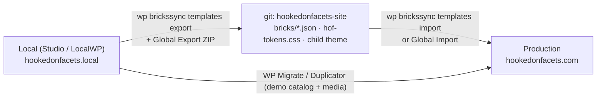

# Bricks build spec — hookedonfacets.com

Copy the design that exists (`BRAND.md`, `marketing/preview/landing.html`, live site) into Bricks so the site and the plugin's own admin UI share one visual language.

## 1. Design system → Bricks

**Global variables** (Bricks → Settings → Custom code, or Global Variables panel): paste `hof-tokens.css`. Every token is `--hof-*` so it never collides with Bricks' own `--bricks-*`.

**Theme Styles** (Bricks → Theme Styles → "HOF"):

| Section | Value |
|---|---|
| Colors → palette "HOF" | Hook purple `#534AB7`, Facet coral `#D85A30`, Deep ink `#2C2C2A`, Warm cream `#F1EFE8`, purple-50/200/400/700, coral-50/200, ink-50…900 (all in `hof-tokens.css`) |
| Typography → body | Geist Sans, 16px / 1.6, color `--hof-ink-900`, background `--hof-cream` |
| Typography → headings | Geist Sans, weight 600, letter-spacing -0.02em, sentence case. H1 56/64 desktop → 36 mobile, H2 40, H3 28, H4 22 |
| Typography → code | Geist Mono 14px |
| Links | `--hof-purple`, underline on hover only |
| Buttons | radius 8px, padding 12px 20px, border 0.5px, **no shadow, no gradient**. Primary = purple bg / white text. Secondary = transparent / 0.5px ink-200 border. Coral is for accent chips only, never a button. |
| Forms | radius 6px, 0.5px `--hof-ink-200` border, focus ring 2px `--hof-purple-200` |
| Container | max 1200px, gutter 24px, section padding 96px desktop / 64px mobile |
| Spacing scale | 4px base: 4 8 12 16 24 32 48 64 96 |
| Breakpoints | Bricks defaults (1200 / 992 / 768 / 478) |
| Fonts | Google Fonts Geist Sans + Geist Mono; or self-host (better: GDPR + speed). Disable Bricks' Google Fonts loading if self-hosting. |
| Icons | Tabler outline (Bricks → Settings → Custom icon font, or inline SVG) |

**Global classes** (from `hof-tokens.css`): `.hof-eyebrow`, `.hof-chip`, `.hof-chip--purple`, `.hof-chip--coral`, `.hof-card`, `.hof-stat`, `.hof-btn`, `.hof-btn--primary`, `.hof-btn--secondary`, `.hof-grid-3`, `.hof-grid-4`, `.hof-divider`.

## 2. Templates (Bricks → Templates)

| Template | Type | Contents |
|---|---|---|
| HOF Header | Header | Logo (`brand/logo.svg`, 28px tall), nav: Features · Demo · Pricing · Docs; right: "Get hooked" primary button → `/pricing`; sticky, cream bg with 0.5px bottom border |
| HOF Footer | Footer | 4 cols: Product (Features, Pricing, Demo, Changelog), Resources (Docs, FAQ, Roadmap, GitHub), Company (SHEPDESIGN, Contact, Support), Legal (Privacy, Terms, Refunds). Bottom row: mark + "© SHEPDESIGN · Filtering, finally fun." |
| HOF Page | Single (Pages) | Container, content |
| HOF Doc | Single (`hof_doc` CPT) | 240px sticky left nav (Query Loop over `hof_doc` grouped by `doc_section` taxonomy), content column max 760px, prev/next |
| HOF Shop | WooCommerce archive | Facet sidebar (HoF shortcode/block) + product grid; this *is* the demo |
| 404 | Error | "That filter returned nothing." + search + links |

## 3. Pages and sections

### `/` Home (mirror of the live site + launch-checklist outline)

1. **Hero**: eyebrow "The new filter standard"; H1 "Filters your visitors will actually use."; sub "Faceted search for WordPress and WooCommerce that feels like a product, not a checkbox list."; buttons "Get hooked" (primary → `/pricing`) + "Watch the 60-second demo" (secondary → `/demo`). Builder badges row: Bricks · Elementor · Breakdance · Oxygen · Gutenberg · WooCommerce. Right: looping screen recording (mp4, muted, poster).
2. **Ask bar**: live "Ask" facet input embedded (Pro feature, running against the demo catalog).
3. **Stats**: 54 ms p95 · any CPT · 16 facet types · 0 frameworks. `.hof-stat` grid-4.
4. **Problem**: "Beyond the checkbox." Three cards: slow, ugly, dead-ends.
5. **Facet showcase**: tabs or 2×3 grid with a live instance each: checkbox, range, color swatch, swipe deck (Pro), spin-the-wheel (Pro), intersection matrix (Pro). Pro ones carry a coral chip "Pro".
6. **Speed proof**: chart image + copy from `bin/benchmark.sh` results (100k products, ~54 ms ids / ~63 ms full / ~19 s reindex).
7. **Builder support** + **Sources** (WooCommerce, ACF, Meta Box, Pods) logo rows.
8. **Pricing teaser**: 4 cards (Free / Personal / Plus / Agency) linking to `/pricing`.
9. **FAQ**: accordion from `docs/faq.md`.
10. **Final CTA**: "Hook in. Stand out." + primary button.

### `/pricing`

- Hero: "Simple pricing. Renewals at half price, like every tier."
- Founder banner (conditionally shown when `?coupon=FOUNDER` is present, via a small inline script): "Beta = founder pricing".
- Four cards. Free → wordpress.org link. Personal / Plus / Agency → `.hof-btn--primary` with `data-fs-plan` + `data-fs-licenses` + hosted-checkout `href` fallback (see `FREEMIUS.md` §5). "Plus" card marked Featured with a purple 0.5px border.
- Comparison table (port `marketing/preview/comparison.html`).
- FAQ: refunds (7 days), what happens when a license expires (soft: keeps working, no updates), upgrades (prorated by Freemius), invoices/VAT.

### `/demo`

- Woo shop archive on the seeded 36-product catalog (`bin/seed-products.sh`), all 16 facets + the Pro ones on. Checkout disabled (Woo → Settings → "Catalog mode" via a 5-line snippet removing add-to-cart), or just leave products purchasable with a test gateway off.

### `/docs`

- Import `docs/*.md` into an `hof_doc` CPT (WP All Import or a one-off WP-CLI script with `wp post create --post_type=hof_doc`). Sections: Getting started · Facets · Builders · Sources · Pro · Performance · FAQ · Changelog.

### `/thanks`, `/account`, `/privacy`, `/terms`, `/refunds`, `/contact`

- `/thanks`: "Check your inbox for the license key" + "Install Pro" steps + Account portal link.
- `/account`: redirect to the Freemius Account page URL from the plugin, or a short page with a button.
- Legal: refund policy = Freemius 7-day; privacy must disclose the Ask facet sends queries to Anthropic.

## 4. Local staging workflow

1. Local plugins: Bricks, WooCommerce, Hooked on Facets (git checkout symlinked into `wp-content/plugins`), Hooked on Facets Pro (same), Freemius for WordPress (optional pricing block), BricksSync, Query Monitor.
2. `define('WP_FS__DEV_MODE', true);` in local `wp-config.php` for Freemius sandbox purchases.
3. Child theme `hof-bricks-child` holds `hof-tokens.css` (enqueued) and any PHP snippets (catalog mode, doc CPT registration, Freemius button shortcode).
4. Commit BricksSync JSON per template/page after every design session. Prod pulls by import; never edit prod in the builder except hotfixes that are immediately exported back.
5. One-time first cut to prod: Bricks → Settings → Global Import/Export → export all (theme styles, classes, variables, palettes, templates) → import on prod.

## 5. Quality gates before beta

- [ ] Lighthouse mobile ≥ 90 on `/`, `/pricing`, `/demo` (self-hosted Geist, WebP/AVIF, `loading=lazy`, Bricks "Disable jQuery" where possible).
- [ ] No layout shift on the hero video (explicit width/height + poster).
- [ ] Keyboard-only run through the demo facets and the checkout overlay.
- [ ] Freemius sandbox purchase from `/pricing` completes and redirects to `/thanks`.
- [ ] 404, search, and doc nav work on mobile (478px).
- [ ] Brand rule check: no shadows, no gradients, 0.5px borders, sentence case everywhere.
