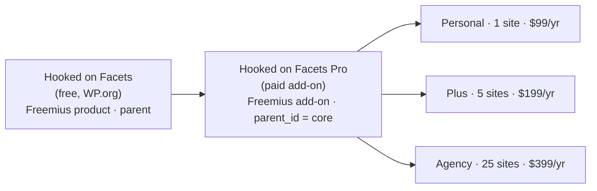

# Freemius setup — Hooked on Facets

Freemius becomes the store, the license server and the update server. hookedonfacets.com only *links* to it.

## 1. Product model



Why parent + add-on rather than one plugin with `__premium_only` fences: the code is *already* split into two repos and two plugins (the core's `build-release.sh` refuses to ship `src/Licensing`, `src/Ai`, `src/VisualDna`). Freemius add-ons get their own plans, checkout and license keys, and the parent's SDK handles activation for both. No merge step, no preprocessor.

## 2. Dashboard steps (Freemius → Developer Dashboard)

1. **Add product** → Plugin → name `Hooked on Facets`, slug `hooked-on-facets`. Free product. Note **Product ID** and **Public key** (Settings → Keys).
2. **Add-ons** tab → **Add add-on** → name `Hooked on Facets Pro`, slug `hooked-on-facets-pro`. Note its **ID** and **Public key**.
3. On the add-on → **Plans**:
   - Personal: single-site $99, billing cycle Annual. Bulk pricing off.
   - Plus: 5 licenses $199/yr.
   - Agency: 25 licenses $399/yr.
   - Each plan: Trial off for beta (turn on a 7-day no-card trial after launch if you want), **Refund policy** 7 days.
   - Add-on **Settings → Renewals discount: 50%**. That is the "Renewals at half price, like every tier" promise on the live site.
   - Enable **Multisite / bulk discount** only if you want per-seat sliders; the three fixed tiers are cleaner.
4. **Coupons** on the add-on: `FOUNDER`, 30% off, first payment only, redemptions 50, expiry = beta end date. (Founder pricing lives in a coupon so the public price table stays stable.)
5. **Integrations → WordPress.org**: mark the core as listed on WP.org once approved so Freemius serves the free build's updates via WP.org and Pro's via its CDN.
6. **Settings → Checkout**: brand color `#534AB7`, logo `brand/logo-mark.svg`, success redirect `https://hookedonfacets.com/thanks/`.
7. **Settings → Emails**: purchase, license, renewal reminders come from Freemius. Set reply-to `support@hookedonfacets.com`.
8. **Payouts**: bank/PayPal + tax form. Freemius handles VAT/GST/US sales tax as MoR.

## 3. SDK integration (code)

### Core (`hooked-on-facets` repo)

```
composer require freemius/wordpress-sdk    # or vendor the SDK folder at vendor/freemius
```

`hooked-on-facets.php`, right after the constants block and before the Composer autoload gate:

```php
require_once HOF_PLUGIN_DIR . 'freemius-bootstrap.php';   // see freemius-bootstrap.php in this folder
```

The bootstrap defines `hof_fs()` and fires `hof_fs_loaded`. `Plugin::boot()` then reads:

```php
$is_pro = function_exists( 'hof_fs' ) && hof_fs()->is_plugin_activated( 'hooked-on-facets-pro' ); // add-on active + licensed
```

`MenuRegistrar` (line ~90) already has a "Pro add-on active" flag for the SPA; replace its detection with `hof_fs()->is_paying_or_trial()` on the add-on instance so the AI/License screens only show for licensed sites.

### Pro add-on (`hooked-on-facets-pro` repo, once attached)

- Main file: `fs_dynamic_init()` with `'parent' => ['id' => CORE_ID, 'slug' => 'hooked-on-facets', 'name' => 'Hooked on Facets']`, `'is_premium' => true`, `'has_paid_plans' => true`, `'is_org_compliant' => false`, and a `fs_hof_pro_is_parent_active_and_loaded()` guard that admin-notices when the core is missing (Freemius' standard add-on snippet).
- **Delete** `src/Licensing/`, `HOF_LICENSE_STORE_URL`, `HOF_LICENSE_ITEM_ID`, `HOF_LICENSE_ENFORCEMENT`, `HOF_LICENSE_DEV_MODE`, the EDD updater, and the `/license` REST routes in `RestController.php`.
- Gate the six signature facets on `hof_pro_fs()->can_use_premium_code()`. Enforcement stays "soft" as before: unlicensed = admin notice + facets fall back to the core equivalents, no fatal.
- `admin/src/components/LicenseSettings.jsx` → a card that links to the Freemius Account page (`hof_pro_fs()->get_account_url()`) and shows plan + expiry from `hof_pro_fs()->get_plan_name()` via a tiny REST endpoint.
- Opt-in dialog: keep Freemius' default; it is the WP.org-compliant path for usage tracking and replaces `src/Telemetry` opt-in for the paid tier.

### Local / CI

```php
define( 'WP_FS__DEV_MODE', true );  // wp-config.php on staging only
```

Never `WP_FS__DEV_MODE` in the shipped ZIP. Add both to `build-release.sh`'s verify step:

```bash
grep -q "WP_FS__DEV_MODE" -r "$VERIFY/$SLUG" && { echo "VERIFY FAIL: dev mode constant shipped"; fail=1; }
[ -d "$VERIFY/$SLUG/vendor/freemius" ] || { echo "VERIFY FAIL: Freemius SDK missing"; fail=1; }
```

## 4. Deployment

| Artifact | Built by | Uploaded to |
|---|---|---|
| `hooked-on-facets-<ver>.zip` (core) | `bin/build-release.sh` | Freemius core product → Deployment; Freemius pushes the free build to WP.org SVN if you enable it, or you `svn ci` yourself. |
| `hooked-on-facets-pro-<ver>.zip` | `bin/build-release.sh` in the pro repo (same script, slug swapped) | Freemius add-on → Deployment → "Release". Updates go out through the SDK. |

Freemius' deployment preprocessor also strips `__premium_only` code if you ever add it to the core; you don't need it with the add-on model.

## 5. Checkout on hookedonfacets.com

**Overlay (primary)** on `/pricing`, one script for the page, one button per plan:

```html
<script src="https://checkout.freemius.com/js/v1/"></script>
<script>
  const hofCheckout = new FS.Checkout({ product_id: PRO_ADDON_ID, public_key: 'pk_...', image: '/wp-content/uploads/hof-mark.svg' });
  document.querySelectorAll('[data-fs-plan]').forEach(btn => btn.addEventListener('click', e => {
    e.preventDefault();
    hofCheckout.open({
      plan_id: btn.dataset.fsPlan,
      licenses: Number(btn.dataset.fsLicenses),
      billing_cycle: 'annual',
      coupon: new URLSearchParams(location.search).get('coupon') || undefined,
      success: () => location.assign('/thanks/')
    });
  }));
</script>
```

**Hosted fallback (href on each button)**: `https://checkout.freemius.com/product/<PRO_ADDON_ID>/plan/<PLAN_ID>/licenses/<N>/`. Works with JS off and in emails.

**Beta / founder link**: `https://hookedonfacets.com/pricing/?coupon=FOUNDER` (the script above forwards it).

Alternatively install the **Freemius for WordPress** plugin and use its Pricing Table block on `/pricing`; it renders the same plans from the API. Use it if you want prices to change from the Freemius dashboard without touching Bricks.

## 6. What Freemius replaces

| Before (EDD scaffold) | After |
|---|---|
| `src/Licensing/` activate/deactivate/revalidate | SDK `is_paying()`, `can_use_premium_code()` |
| EDD updater | SDK updater (Pro) + WP.org (free) |
| `HOF_LICENSE_*` constants | none (`WP_FS__DEV_MODE` for local only) |
| License screen in React admin | Freemius Account page |
| Stripe catalog `hof_*` + webhook + license HMAC | Freemius checkout, licenses, emails |
| Refunds/tax/invoices | Freemius (MoR) |
